 

[**portfolio**](https://santoshcheethirala.me)&ensp;·&ensp;[**glassbox**](https://github.com/santoshcheethiralame-dot/glassbox)&ensp;·&ensp;[**gradient**](https://github.com/santoshcheethiralame-dot/gradient)&ensp;·&ensp;[**orbit**](https://github.com/santoshcheethiralame-dot/orbit)&ensp;·&ensp;[**email**](mailto:santoshcheethirala.me@gmail.com)

<!--
optional: top languages card themed to match the panel. uncomment to enable.

-->
